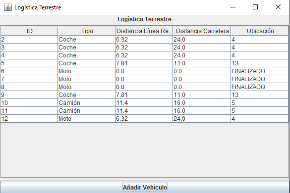
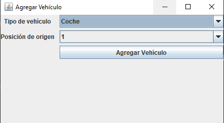
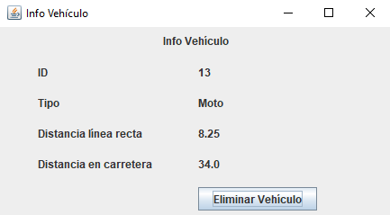

[](https://sonarcloud.io/dashboard?id=ldhLogistica_logisticaTerrestre)
[](https://sonarcloud.io/dashboard?id=ldhLogistica_logisticaTerrestre)
[](https://travis-ci.com/ldhLogistica/logisticaTerrestre)
[](https://sonarcloud.io/dashboard?id=ldhLogistica_logisticaTerrestre)
[](https://sonarcloud.io/dashboard?id=ldhLogistica_logisticaTerrestre)
[](https://sonarcloud.io/dashboard?id=ldhLogistica_logisticaTerrestre)
[](https://sonarcloud.io/dashboard?id=ldhLogistica_logisticaTerrestre)
[](https://sonarcloud.io/dashboard?id=ldhLogistica_logisticaTerrestre)
[](https://sonarcloud.io/dashboard?id=ldhLogistica_logisticaTerrestre)

# Logística Terrestre

_Este proyecto simula el proceso de cálculo del camino mínimo de varios vehículos simultáneamente y sus desplzamiento_

## Desarrollado por las siguientes tecnologías

- Maven
- Sonar
- GitHub
- TravisCI

## Testeado con

- JUnit

## Instalación

- Clonar el repositorio con el siguiente comando

```
git clone https://github.com/ldhLogistica/logisticaTerrestre.git
```

- Instalar dependencias de Maven dentro del directorio con el siguiente comando

```
mvn install
```

- Ejecutar con el siguiente comando

```
java -jar logisticaTerrestre.jar
```

## Uso

- Al ejecutar la aplicación aparece una ventana como la siguiente con la rejilla vacía:



- Para añadir un vehiculo, se pulsa en el boton inferior y se elige el tipo de vehiculo y su origen



- Para eliminar un vehiculo, se pulsa sobre el vehiculo objetivo en la tabla y se da a eliminar en la ventana nueva que sale



## Autores

- Samuel Fumero Hernández - [alu0101033112](https://github.com/SamuelFumeroHdez)
- David Marcos Ramallo Gracia - [alu0101061320](https://github.com/alu0101061320)


